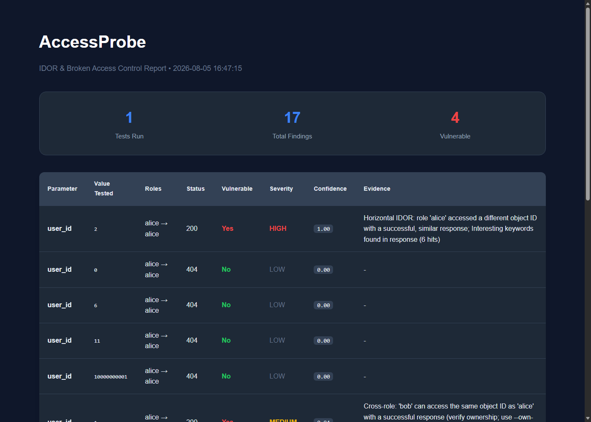

# AccessProbe

IDOR and broken access control scanner. Multi-role / multi-session testing, horizontal object-ID checks, confidence scoring, JSON and HTML reports.

Validated on a local multi-user lab and OWASP Juice Shop (`127.0.0.1` only).

[](https://github.com/moadh704/accessprobe)
[](https://www.python.org/)
[](https://github.com/moadh704/accessprobe)

## Results (v0.4.1)

| Check | Result |
|-------|--------|
| Tests | 48/48 passed |
| Broken lab profile (horizontal IDOR) | Detected (confidence 1.00) |
| Secure lab profile (correct ACL) | 0 false positives with `own_ids` + `privileged_roles` |
| Juice Shop basket path IDOR | Detected (confidence 1.00) |


*Secure endpoint: 3 FPs (v0.3) → 0 FPs (v0.4) with ownership map and privileged roles.*



Details: [docs/TEST_RESULTS.md](docs/TEST_RESULTS.md) · Plan: [docs/TEST_PLAN.md](docs/TEST_PLAN.md)

## Features

- Horizontal IDOR (same role, other object IDs)
- Cross-role access tests
- Ownership map (`own_ids` / `--own-ids`) to drop self-access noise
- Privileged roles (`privileged_roles` / `--privileged-roles`) for intended admin access
- Parameter discovery (URL, HTML, JS, JSON)
- Query, path, body, header, cookie parameters
- Cookie files, raw cookies, Bearer JWT headers
- Rate limiting (`--delay`), JSON/HTML reports

## Install

```bash
git clone https://github.com/moadh704/accessprobe.git
cd accessprobe
pip install -e .
pip install -e ".[dev]"   # optional
```

## Quick start

```bash
mkdir -p cookies
# put browser-exported cookies in cookies/user.txt and cookies/admin.txt

cp examples/example_config.yaml my_scan.yaml
# edit URL, roles, own_ids, privileged_roles

accessprobe scan --config my_scan.yaml \
  --report results.json --html-report report.html
```

Without a config file:

```bash
accessprobe scan \
  --url "https://target.example.com/profile" \
  --param user_id --value 1 \
  --original-role user --test-roles admin \
  --cookie "session=YOUR_SESSION" \
  --own-ids "user=1;admin=99" \
  --privileged-roles admin \
  --report out.json
```

Path parameters need a `{name}` placeholder, or a URL that already contains the ID as a path segment:

```bash
accessprobe scan \
  --url "http://127.0.0.1:3000/rest/basket/{id}" \
  --param id --value 8 --location path \
  --original-role alice --test-roles bob
```

Discover parameters:

```bash
accessprobe discover --url "https://target.example.com/profile?user_id=1" --cookie "session=..."
```

## Ownership and privileged roles

```yaml
scan:
  own_ids:
    alice: ["1"]
    bob: ["2"]
  privileged_roles:
    - admin
```

| Setting | Effect |
|---------|--------|
| `own_ids` | Role accessing its own IDs is not reported as IDOR |
| `privileged_roles` | That role’s broad access is not treated as a finding |
| Omitted | Tool still runs; more leads need manual review |

CLI: `--own-ids alice=1;bob=2` and `--privileged-roles admin`.

## Flags

| Flag | Description |
|------|-------------|
| `--min-confidence 0.55` | Min confidence to mark vulnerable |
| `--delay 0.25` | Delay between requests (seconds) |
| `--no-horizontal` | Skip same-role alternate-ID tests |
| `--own-ids` | Ownership map |
| `--privileged-roles` | Privileged roles |
| `--location query\|path\|body\|header\|cookie` | Parameter placement |
| `--header "Name: Value"` | Extra header (JWT `Authorization: Bearer …`) |
| `--discover` | Discover parameters during scan |

Exit codes: `0` scan completed with no findings, `1` config/runtime error, `2` potential IDORs found.

## Labs

Local IDOR lab:

```bash
python labs/idor_lab/server.py 8765

accessprobe scan --config labs/idor_lab/scan_vuln.yaml \
  --report labs/results/v0.4/vuln.json --html-report labs/results/v0.4/vuln.html

accessprobe scan --config labs/idor_lab/scan_secure.yaml \
  --report labs/results/v0.4/secure.json
# with default config: 0 vulnerable findings on secure profile
```

Juice Shop (must already be on `127.0.0.1:3000`):

```bash
python labs/juice_shop/setup_and_scan.py
```

See [labs/idor_lab/README.md](labs/idor_lab/README.md) and [labs/juice_shop/README.md](labs/juice_shop/README.md).

## Development

```bash
pip install -e ".[dev]"
pytest -q   # 48 passed
```

## Layout

```text
accessprobe/       package
docs/              TEST_PLAN.md, TEST_RESULTS.md, assets/
labs/idor_lab/     multi-user local target
labs/juice_shop/   Juice Shop helper (secrets not committed)
labs/results/      scan artifacts
tests/
```

## Disclaimer

For authorized testing and education only. Only use on systems you own or have permission to test. Repo validation was run on `127.0.0.1`.
