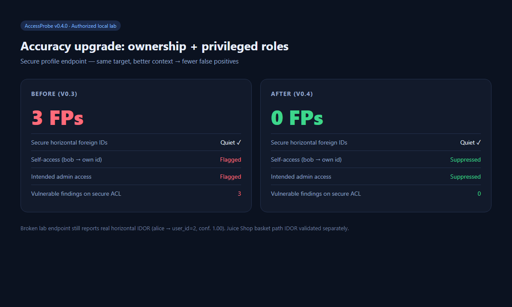

# AccessProbe — Test Results

| | |
|--|--|
| Version | 0.4.1 |
| Date | 2026-08-05 |
| Environment | Windows · Python 3.14 · Node 24 · `127.0.0.1` only |
| Targets | Local IDOR lab + local OWASP Juice Shop 19.2.1 |

No external or production systems were scanned.



## Summary

| Area | Result |
|------|--------|
| Unit / integration tests | 38/38 passed |
| Horizontal IDOR (broken ACL) | Detected (high confidence) |
| Secure ACL foreign IDs | Not flagged |
| Self-access / intended admin (with context) | Suppressed → **0** vulnerable findings on secure lab |
| Juice Shop basket path IDOR | Detected (confidence 1.00) |
| Path params + Bearer JWT | Works |
| Parameter discovery | Works on lab homepage |

**v0.3 → v0.4:** ownership map (`own_ids`) and `privileged_roles` removed the main false positives on the secure profile (self-access and intended admin). Broken endpoints still report real IDORs.

## Before / after (secure profile)

Target: `GET /secure/profile?user_id=N` (own profile or admin only).

| Case | v0.3 | v0.4 (`own_ids` + `privileged_roles: admin`) |
|------|------|-----------------------------------------------|
| alice → id=2 (403) | TN | TN |
| bob → id=2 (own, 200) | FP | Suppressed |
| admin → id=1/2 (200) | FP | Suppressed |
| **Vulnerable findings** | **3** | **0** |

Broken `GET /vuln/profile`: alice → user_id=2 still reported (confidence 1.00). bob → own id suppressed.

Outputs: `labs/results/v0.4/`.

## Classification

| Code | Meaning |
|------|---------|
| TP | Real issue correctly reported |
| FP | Legitimate access incorrectly reported |
| TN | Correctly not reported |
| FN | Real issue missed |

Ground truth checked with curl/httpx before trusting the scanner.

## Unit tests

```text
$ pytest -q
38 passed
```

## Local IDOR lab

### Endpoints

| Endpoint | ACL |
|----------|-----|
| `/vuln/profile?user_id=N` | Broken |
| `/secure/profile?user_id=N` | Own or admin |
| `/orders?order_id=N` | Broken |

| Cookie | user_id | Role |
|--------|---------|------|
| alice | 1 | user |
| bob | 2 | user |
| admin | 3 | admin |

### Config used (v0.4)

```yaml
own_ids:
  alice: ["1"]
  bob: ["2"]
  admin: ["3"]
privileged_roles:   # secure scan only
  - admin
```

### Commands

```bash
python labs/idor_lab/server.py 8765

accessprobe scan --config labs/idor_lab/scan_vuln.yaml \
  --report labs/results/v0.4/vuln.json --html-report labs/results/v0.4/vuln.html

accessprobe scan --config labs/idor_lab/scan_secure.yaml \
  --report labs/results/v0.4/secure.json --html-report labs/results/v0.4/secure.html

accessprobe scan --config labs/idor_lab/scan_orders.yaml \
  --report labs/results/v0.4/orders.json
```

### Ground truth

| Request | Status |
|---------|--------|
| alice → `/vuln/profile?user_id=2` | 200 (Bob’s data) |
| alice → `/secure/profile?user_id=2` | 403 |
| alice → `/secure/profile?user_id=1` | 200 |

### Vulnerable profile

| Finding | Conf. | Class |
|---------|-------|-------|
| alice → user_id=2 | 1.00 | TP |
| bob → user_id=1 | 0.84 | TP |
| bob → user_id=2 (own) | — | Suppressed |
| admin → user_id=1/2 | 0.84–0.96 | TP (broken ACL; admin not privileged in this config) |
| Invalid IDs (404) | 0.00 | TN |

4 vulnerable findings reported.

### Secure profile

| Finding | Class |
|---------|-------|
| alice → user_id=2 (403) | TN |
| bob → user_id=1 (403) | TN |
| bob → user_id=2 | Suppressed (self-access) |
| admin → user_id=1/2 | Suppressed (privileged) |
| **Vulnerable findings** | **0** |

### Orders

Non-owned order IDs flagged (up to conf. 1.00). Alice’s owned IDs (100/101) suppressed. Endpoint is intentionally broken.

### Discovery

From `GET /` with `session=alice`: `user_id`, `account_id`, `order_id`, `id` (4 params).

## Juice Shop (local)

| | |
|--|--|
| Host | `http://127.0.0.1:3000` |
| Auth | JWT `Authorization: Bearer …` |
| Endpoint | `GET /rest/basket/{id}` |

| Call | Status |
|------|--------|
| alice → own basket | 200 |
| alice → bob’s basket | 200 (IDOR) |

| Finding | Conf. | Class |
|---------|-------|-------|
| alice → bob basket | 1.00 | TP |
| Other numeric basket IDs (200) | 0.75–1.00 | TP / triage |

Use URL form `…/rest/basket/{id}`. Helper: `python labs/juice_shop/setup_and_scan.py` (JWTs not committed).

Outputs: `labs/results/juice_shop/`.

## Edge cases and CLI

| Case | Result |
|------|--------|
| Path parameters | OK (needs `{name}` in URL) |
| Missing config file | Clear error |
| No session (lab) | 401, no false IDORs |
| `--own-ids` / `--privileged-roles` | OK |
| Field-name / date candidates | Mostly filtered in v0.4 |
| JSON / HTML reports | OK |

No crashes in this run.

## Limitations

| Issue | Notes |
|-------|--------|
| Context optional | Without `own_ids`, self-access can still appear as a lead |
| Cross-role body differences | Occasional under-scoring when responses differ a lot |
| UUID-heavy apps | Not heavily exercised in the lab |
| DVWA / PortSwigger | Not included in this run |
| JWT configs | Generated locally; gitignored |

## Reproduce

```bash
git clone https://github.com/moadh704/accessprobe.git
cd accessprobe
pip install -e ".[dev]"
pytest -q

python labs/idor_lab/server.py 8765
accessprobe scan --config labs/idor_lab/scan_vuln.yaml \
  --report labs/results/v0.4/vuln.json --html-report labs/results/v0.4/vuln.html
accessprobe scan --config labs/idor_lab/scan_secure.yaml \
  --report labs/results/v0.4/secure.json

# optional: Juice Shop on :3000
python labs/juice_shop/setup_and_scan.py
```

## Artifacts

| Path | Contents |
|------|----------|
| `docs/assets/accuracy-before-after.png` | Before/after summary image |
| `docs/assets/report-vuln.png` | HTML report screenshot |
| `labs/results/v0.4/*` | Lab scans (v0.4) |
| `labs/results/juice_shop/*` | Juice Shop basket scan |
| `docs/TEST_PLAN.md` | Test plan |
